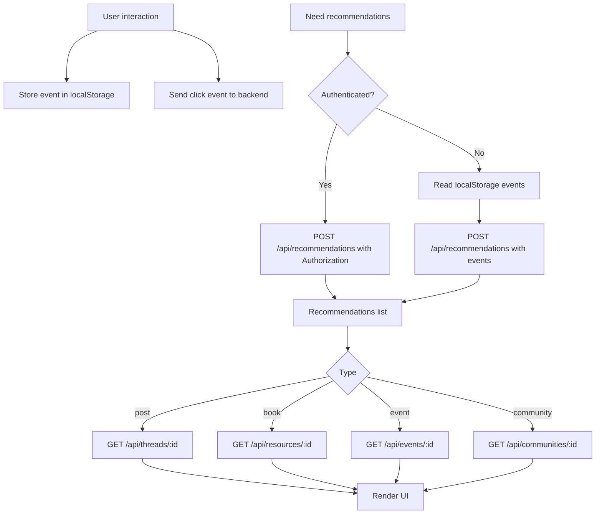

# Recommendations Flow (Frontend)

This document describes how the frontend gathers signals and retrieves AI recommendations.

## Summary

1. User interacts (post, book, event, community).
2. If unauthenticated, store the interaction event in `localStorage`.
3. When recommendations are needed:
   - Authenticated: call recommendations endpoint with auth header (backend uses activity logs).
   - Unauthenticated: read `localStorage` and send `events` in the request body.
4. Backend returns recommendations and the UI hydrates details per type.
5. UI renders curated sections (with fallback to normal lists when empty).

## Local Storage

- Key: `aksara_recent_events`
- Shape:
```json
[
  {
    "event_type": "book_click",
    "item_id": "cmjyfn0f6000y1387zj4xsg32",
    "item_type": "book",
    "timestamp": "2026-01-05T02:09:37.904Z"
  }
]
```

## API Calls

### Recommendations (Core)

```
POST /api/recommendations?type=<type>&limit=<n>
```

- Authenticated: send `Authorization: Bearer <token>`.
- Unauthenticated: include `events` in the body.
- Optional tag filter: `tag=<tag>` or `tags=tag1,tag2`.

Example (unauthenticated):
```json
{
  "events": [
    {
      "event_type": "book_click",
      "item_id": "cmjyfn0f6000y1387zj4xsg32",
      "item_type": "book",
      "timestamp": "2026-01-05T02:09:37.904Z"
    }
  ]
}
```

Note: there is no separate click-events endpoint. The backend only receives
unauth events when the frontend calls the recommendations endpoint.

### Tag Suggestions (Literature)

```
GET /api/recommendations/tags?limit=6
```

If suggestions return tags that yield empty results, try the next tag or fall back
to unfiltered recommendations.

## Authenticated Activity Logging

Authenticated user activity is recorded automatically by backend middleware.
This is what powers personalized recommendations for logged-in users.

- No frontend click-events endpoint is required.
- Just call the usual API routes; the backend logs activity.

## Interest Score Updates

The backend automatically updates `profiles.interestScores` when authenticated
users interact with resources, events, communities, or posts. Tag scores are
incremented based on activity type (views, clicks, joins, etc.), so the
recommendation tags become more personalized over time.

### Hydration by Type

- `post` → `GET /api/threads/:id`
- `book` → `GET /api/resources/:id`
- `event` → `GET /api/events/:id`
- `community` → `GET /api/communities/:id`

## Flowchart


